# Orientação sobre commits

- Instalação do ambiente no VS Code (caso não tenha o VS Code, realize a instalação).

- O Git é uma aplicação baseada em comandos e não é nativa do Windows nem do VS Code. Sendo assim, é necessária a instalação. Com ele, por meio de comandos e da sua conta do GitHub, é possível realizar uploads e downloads de arquivos.

- Baixe o instalador do Git no link oficial:  
https://git-scm.com/install/windows  

Ou pesquise no navegador (Google): **git instalação** ou **instalar git**.

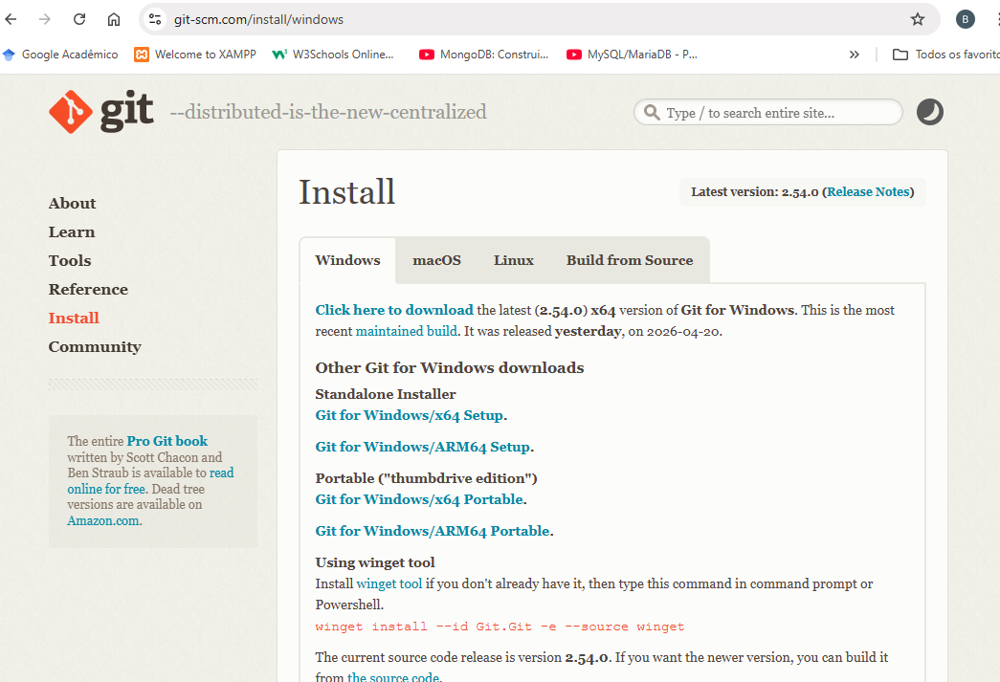

---

Após a instalação e com sua conta do GitHub, acesse o repositório do projeto:  
https://github.com/jonathangabs/TotemAtendimento/tree/main  

Abra o VS Code e siga os passos:

---

Com o VS Code aberto, realize este passo:  
Clique em **Conectar à conta**:

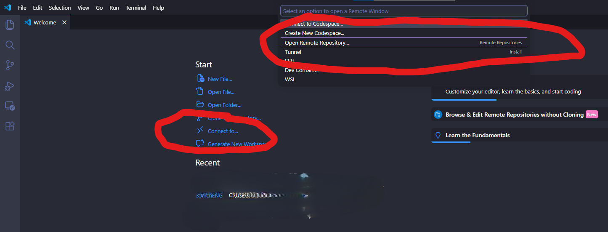

Depois clique em **Open Remote Repository**:

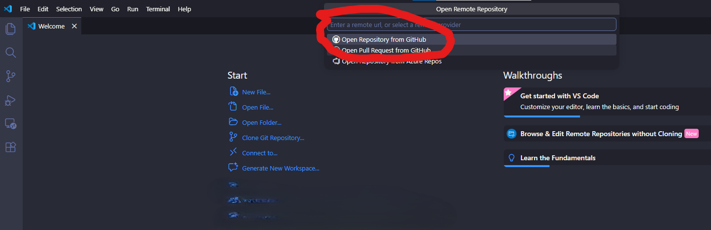

Confirme para logar e realizar o vínculo entre as duas plataformas:

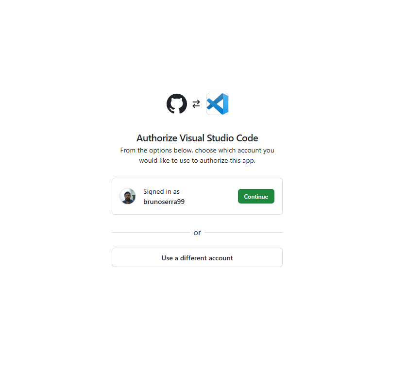

---

Acesse o repositório do projeto:  
https://github.com/jonathangabs/TotemAtendimento/tree/main  

E copie o link para download:

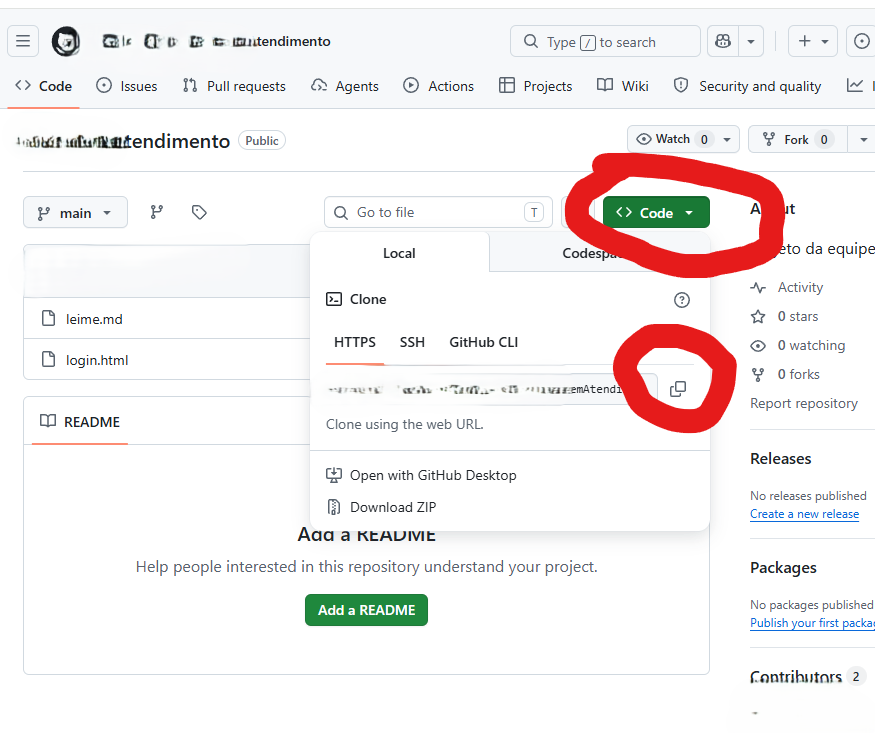

---

Em **File** (Arquivo), selecione **New Window** (Nova janela):

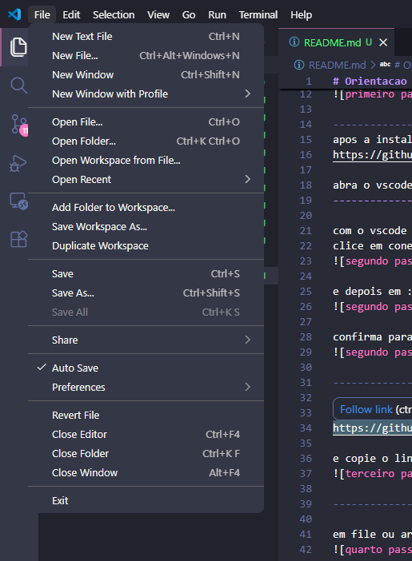

---

Na aba lateral esquerda, selecione a opção indicada.  
Clique e cole o link copiado do repositório do GitHub:

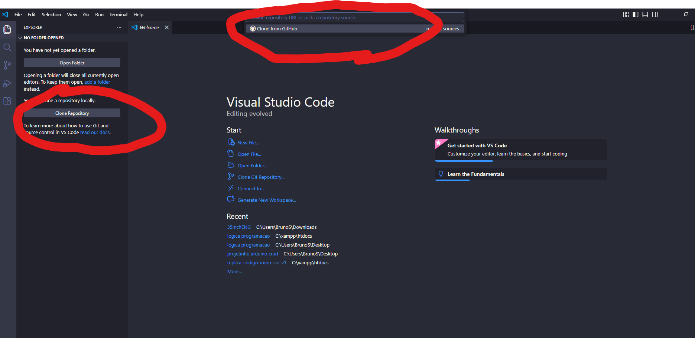

---

Crie uma pasta na aba que apareceu.  
Sugestão:  
`gestao_projeto_carol`

E dentro dela salve o repositório:

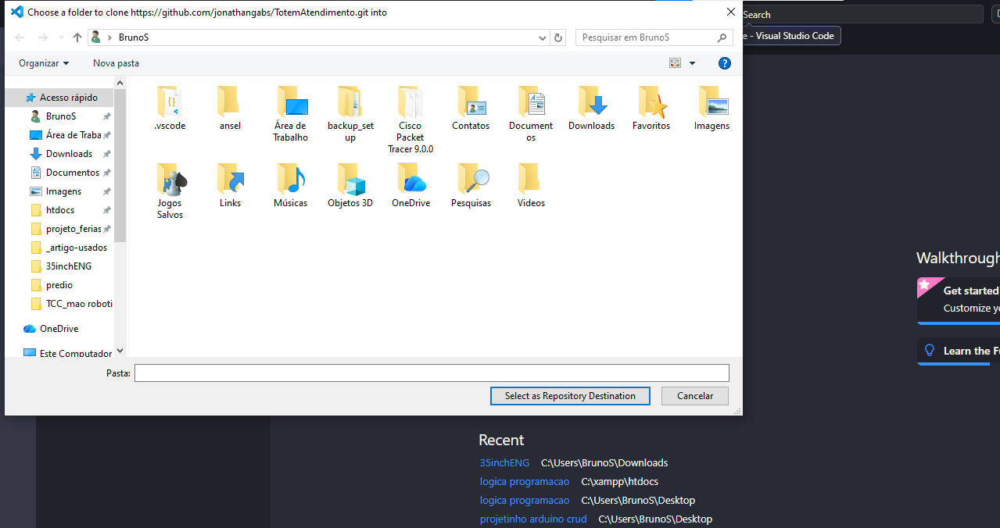

Ficando assim:

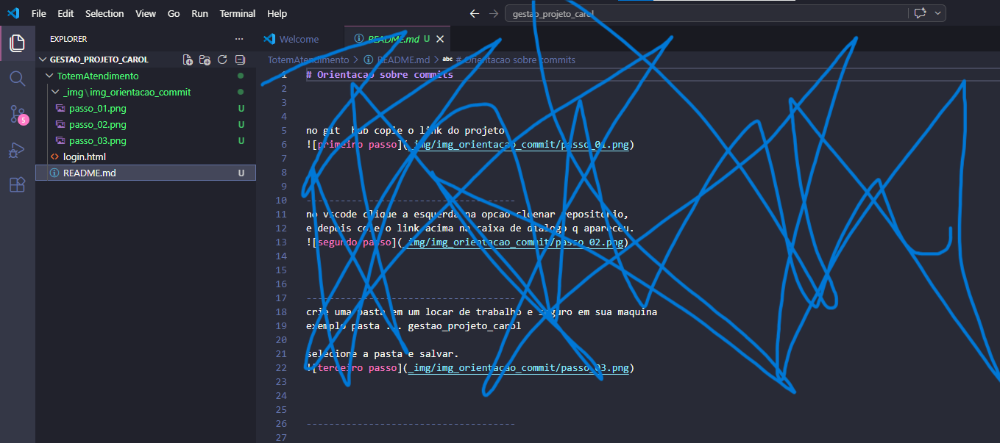

---

Após iniciar e/ou alterar os arquivos, será necessário realizar os comandos para enviar (upload) para o GitHub.

Abra o terminal e verifique se está na pasta que contém o projeto:

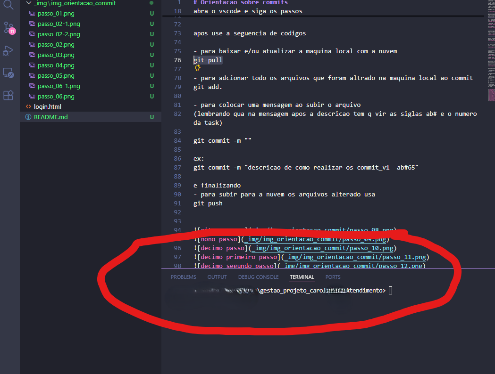

---

Depois, use a sequência de comandos:

- Para baixar e/ou atualizar a máquina local com a nuvem:

```bash
git pull
```

- Para adicionar todos os arquivos alterados na máquina local ao commit:

```bash
git add .
```

- Para adicionar uma mensagem ao commit:  
(Lembre-se: após a descrição, deve conter as siglas **ab#** e o número da task)

```bash
git commit -m ""
```

Exemplo:

```bash
git commit -m "descricao de como realizar os commits_v1 ab#65"
```

- Para enviar os arquivos para a nuvem:

```bash
git push
```

---

- Note aqui que o usuário não está conectado:

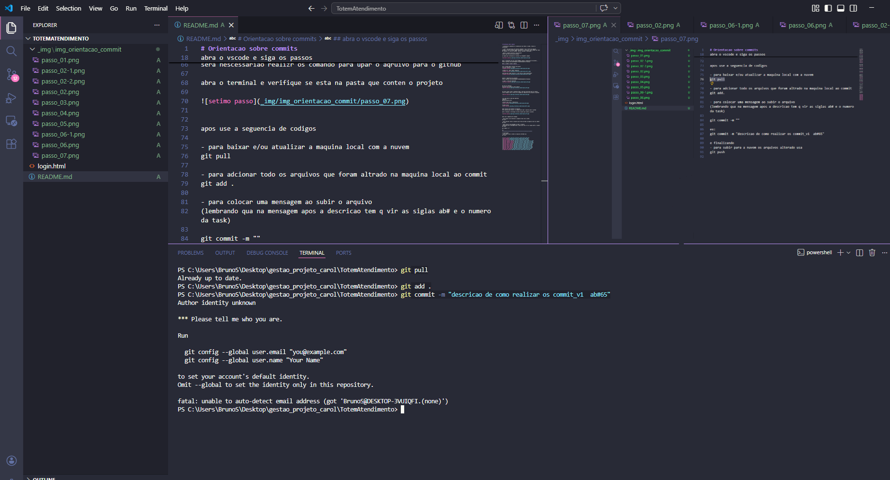

- Neste exemplo, foram ajustados os comandos com as credenciais:

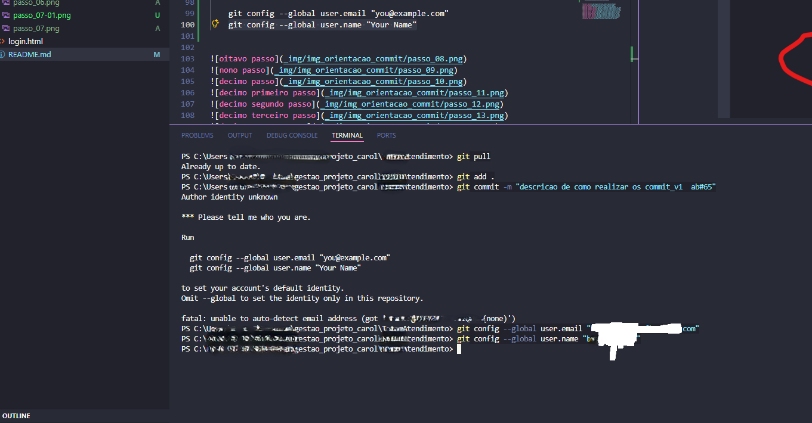

```bash
git config --global user.email "you@example.com"
git config --global user.name "Your Name"
```

- Após adicionar as credenciais, o commit segue normalmente:  
(À esquerda, os arquivos ficam brancos, indicando que não há diferenças em relação à última atualização — pull ou push. Os arquivos em verde são os alterados no momento.)

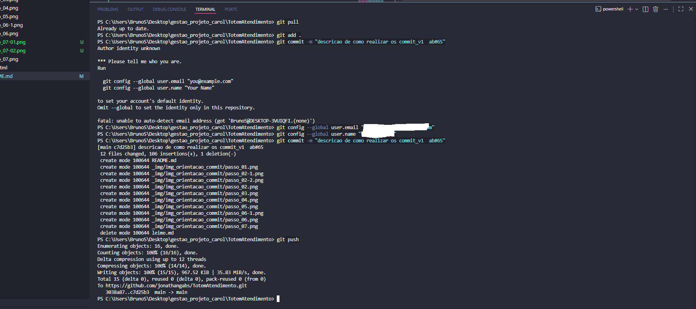

---

- Finalizando o commit já cadastrado:

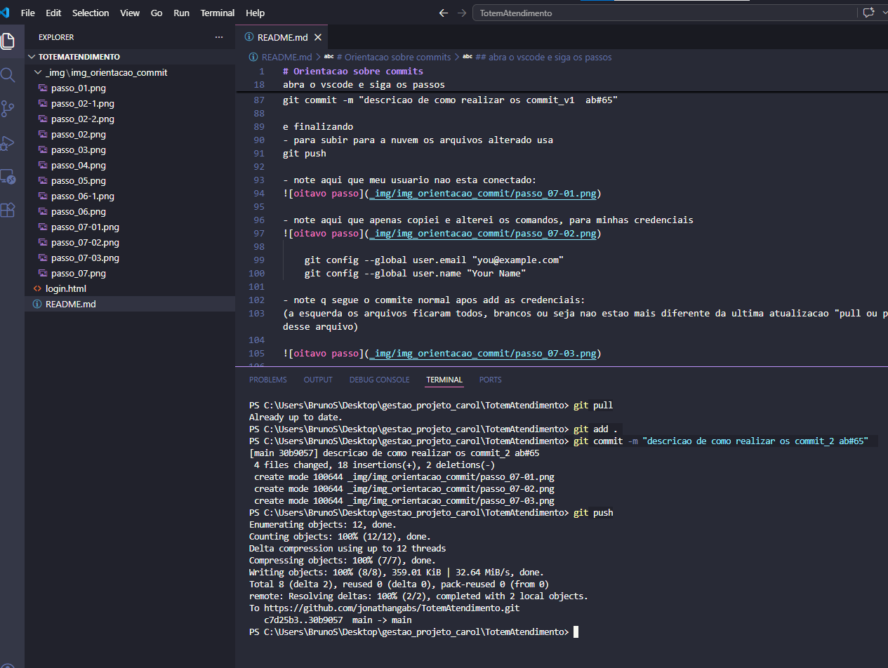